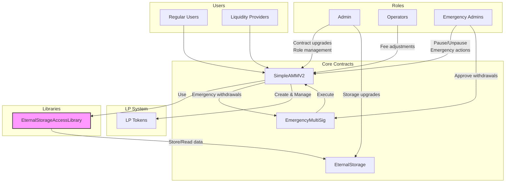

# SimpleAMM v2 Documentation

## Architectural Overview

### Core Components

1. **SimpleAMMV2 (Main Contract)**

   - Implements core AMM functionality using constant product formula (x\*y=k)
   - Handles liquidity provision, swaps, and emergency functions
   - Uses eternal storage pattern for upgradability
   - Implements role-based access control

2. **EternalStorage**

   - Pure storage contract that persists data across upgrades
   - Implements access control to restrict data access
   - Stores primitive types (uint256, string, address, bool, bytes, int256)
   - SimpleAMMV2 uses `EternalStorageAccessLibrary` to access `EternalStorage`

3. **EmergencyMultiSig**

   - Multi-signature wallet for emergency withdrawals
   - Implements time-bound proposals
   - Requires multiple approvals for execution

4. **LPToken**

   - ERC20-compliant token representing liquidity provider shares
   - Minted when liquidity is added
   - Burned when liquidity is removed

5. **Migration Scripts**

   - Deploy a new contract and upgrade the storage contract
   - See [Migration_Guide.pdf](./Migration_Guide.pdf)

### Core Features

1. **Token Support**

   - Supports ETH and any standard ERC20 tokens
   - Multiple token pairs (ETH-Token pools)
   - Constant product formula (x\*y=k) for price discovery

2. **Pool Management**
   - Automated market making
   - Fee earning for liquidity providers
   - Dynamic pricing based on pool reserves
   - Anti-manipulation mechanisms (minimum liquidity)

### System Architecture



**Role Permissions:**

1. **Admin (DEFAULT_ADMIN_ROLE)**

   - Upgrade contract implementations
   - Manage roles (grant/revoke)
   - Initialize contracts

2. **Operators (OPERATOR_ROLE)**

   - Adjust trading fees

3. **Emergency Admins (EMERGENCY_ROLE)**
   - Pause/unpause contracts
   - Propose emergency withdrawals
   - Approve emergency actions

**Contract Interactions:**

1. **SimpleAMMV2**

   - Core AMM logic
   - Interacts with `EternalStorage` for data persistence with `EternalStorageAccessLibrary`
   - Creates and manages LP tokens directly
   - Executes emergency actions through `EmergencyMultiSig`

2. **EternalStorage**

   - Stores all contract state
   - Controlled by admin
   - Accessed through `EternalStorageAccessLibrary`
   - only logic contract can set data

3. **EmergencyMultiSig**

   - Requires multiple approvals
   - Time-locked proposals
   - Executes through `SimpleAMMV2`

4. **LPToken System**
   - Factory creates unique tokens per pool
   - ERC20-compliant tokens
   - Managed by `SimpleAMMV2`

## Design Rationale

### 1. Upgradability Pattern

The system uses the eternal storage pattern for upgradability:

- **Why Eternal Storage?**
  - Separates storage from logic
  - Allows contract logic upgrades without data migration
  - Maintains consistent storage layout across versions
  - Simpler than proxy patterns

### 2. Security Features

Multiple security layers are implemented:

- **Role-Based Access Control**

  - `DEFAULT_ADMIN_ROLE`: Contract administration
  - `OPERATOR_ROLE`: Fee management
  - `EMERGENCY_ROLE`: Emergency operations

- **Emergency Controls**

  - Multi-sig requirement for emergency actions
  - Pausable functionality
  - Emergency withdrawal mechanism

- **Safety Checks**
  - Slippage protection
  - Price impact limits
  - Maximum trade size limits
  - Deadline checks
  - Zero address/value checks
  - Maximum trade size limited to `50%` of pool
  - Maximum allowed slippage of `20%`
  - `24-hour` timelock on emergency proposals

### 3. AMM Design

The AMM implements a constant product formula with several optimizations:

- **Pool Management**

  - Dynamic pool creation
  - Minimum liquidity requirement
  - Core invariant: Reserve ratio

- **Trading**
  - Configurable fees
  - Price impact calculation and slippage protection
  - Core invariant: Constant product formula

## User Guide

### For Liquidity Providers

1. **Adding Liquidity**

   ```javascript
   function addLiquidity(address tokenAddress, uint256 tokenAmount) external payable returns (uint256 shares)
   ```

   - Approve token spending first
   - Send ETH along with the transaction
   - Receive LP tokens representing your share

2. **Removing Liquidity**
   ```javascript
   function removeLiquidity(
       address tokenAddress,
       uint256 shares,
       uint256 minEthOut,
       uint256 minTokensOut,
       uint256 deadline
   )
   ```
   - Specify minimum output amounts
   - Set reasonable deadline
   - Burn LP tokens to receive underlying assets

### For Traders

1. **ETH to Token Swaps**

   ```javascript
   function swapETHForTokens(
       address tokenAddress,
       uint256 minTokensOut,
       uint256 maxSlippage,
       uint256 deadline
   )
   ```

   - Set max slippage
   - Set deadline

2. **Token to ETH Swaps**
   ```javascript
   function swapTokensForETH(
       address tokenAddress,
       uint256 tokenAmount,
       uint256 minEthOut,
       uint256 maxSlippage,
       uint256 deadline
   )
   ```
   - Set max slippage
   - Set deadline

## Developer Guide

### Contract Deployment

1. **Deploy Storage**

   ```bash
   forge script script/Deploy.s.sol:DeployScript --rpc-url $RPC_URL --broadcast
   ```

2. **Upgrade & Migration**
   - See [Migration_Guide.pdf](./Migration_Guide.pdf)

### Integration Guide

1. **Pool Integration**

   ```javascript
   // Get pool information
   (uint256 tokenReserve, uint256 ethReserve, uint256 totalShares) = amm.getPoolInfo(tokenAddress);

   // Get spot price
   uint256 price = amm.getSpotPrice(tokenAddress);

   // Get swap information
   (uint256 amountOut, uint256 priceImpact) = amm.getSwapInfo(tokenAddress, amountIn, isEthIn);
   ```

2. **Event Monitoring**
   ```javascript
   event LiquidityAdded(address indexed provider, address indexed token, uint256 tokenAmount, uint256 ethAmount, uint256 shares);
   event LiquidityRemoved(address indexed provider, address indexed token, uint256 tokenAmount, uint256 ethAmount, uint256 shares);
   event TokenSwap(address indexed token, uint256 tokenAmount, uint256 ethAmount);
   ```

### Emergency Procedures

1. **Pausing the System**

   ```javascript
   // Only EMERGENCY_ROLE
   amm.pause();
   ```

2. **Emergency Withdrawal**

   ```javascript
   // Requires multi-sig approval
   multiSig.proposeWithdrawal(token, recipient, amount);
   multiSig.approveWithdrawal(proposalId);
   multiSig.executeWithdrawal(proposalId);
   ```

3. **Rollback Procedure**
   ```bash
   forge script script/migration/Rollback.s.sol:RollbackScript --rpc-url $RPC_URL --broadcast
   ```

## Out of Scope Features

- Not Support **werid ERC20 tokens**, e.g. different decimals, fee-on-transfer, etc.
- Cancellation of multi-sig proposals
- Adding/revoking signers, operators, emergency admins, etc.

## Contract Security

- Avoid Reentrancy Attacks
  - Follow the CEI pattern(Check-Effect-Interaction)
  - Use `ReentrancyGuardTransient`
- Overflow/Underflow
  - No need to check since soliditVy version >= `0.8.0`
- Denial of Service (DoS)
  - Not Found
- Vault inflation attack
  - Avoid by sending a small amount of reserves to address(1)
- Self-destruct attack
  - Due to time limit, I didn't implement this.
  - Need to add a `skim` function to skim the reserves to the admin
- Static Analysis
  - use slither to analyze the code, config in [slither.config.json](./slither.config.json)
  - use aderant to analyze the code, see [report.md](./report.md)
- Formal Verification
  - Due to time limit, I didn't implement this.

## Tests

- Unit Tests
  - see `./test` directory
- Fuzz Tests
  - see `./test/fuzz` directory
- Handler-based invariant(property-based) tests
  - `AddLiquidity`/`RemoveLiquidity`: the ratio of `tokenReserve`/`ethReserve` should be the same as the initial value
    - see [test/invariant/LiquidityInvariant.t.sol](./test/invariant/LiquidityInvariant.t.sol)
  - `swapETHForTokens`/`swapTokensForETH`: the reserve product should be a bit greater than the last value considering the fee(`100% < product < 105%`)
    - see [test/invariant/SwapInvariant.t.sol](./test/invariant/SwapInvariant.t.sol)
  - Other invariants
    - see [test/invariant/SimpleAMMV2.invariant.t.sol](./test/invariant/SimpleAMMV2.invariant.t.sol)

Note: Due to limited time, only important tests are implemented. The coverage is not 100%.

```bash
forge test
```

<details>
<summary> Click to see test results </summary>

```bash
Ran 15 tests for test/SimpleAMMV2.t.sol:SimpleAMMV2Test
[PASS] test_AddLiquidity() (gas: 798965)
[PASS] test_EmergencyPause() (gas: 49071)
[PASS] test_EmergencyWithdrawal() (gas: 1252414)
[PASS] test_GetSpotPrice() (gas: 789345)
[PASS] test_GetSwapInfo() (gas: 793615)
[PASS] test_GetVersion() (gas: 9490)
[PASS] test_InitialSetup() (gas: 47007)
[PASS] test_RemoveLiquidity() (gas: 883108)
[PASS] test_RevertIf_EmergencyWithdrawal_NotEnoughApprovals() (gas: 933197)
[PASS] test_RevertWhenDeadlineExpired() (gas: 16686)
[PASS] test_Slippage() (gas: 802895)
[PASS] test_SupportMultipleTokens() (gas: 2071402)
[PASS] test_SwapETHForTokens() (gas: 821940)
[PASS] test_SwapTokensForETH() (gas: 826020)
[PASS] test_Unpause() (gas: 800903)
Suite result: ok. 15 passed; 0 failed; 0 skipped; finished in 9.86ms (4.28ms CPU time)

Ran 26 tests for test/storage/EternalStorage.t.sol:EternalStorageTest
[PASS] testAddressStorage() (gas: 28744)
[PASS] testAddressStorageUnauthorized() (gas: 15189)
[PASS] testBoolStorage() (gas: 27480)
[PASS] testBoolStorageUnauthorized() (gas: 13624)
[PASS] testBytesStorage() (gas: 84754)
[PASS] testBytesStorageUnauthorized() (gas: 14294)
[PASS] testConstructor() (gas: 17881)
[PASS] testConstructorZeroAddressReverts() (gas: 38928)
[PASS] testFuzz_AddressStorage(bytes32,address) (runs: 256, μ: 37487, ~: 37487)
[PASS] testFuzz_BoolStorage(bytes32,bool) (runs: 256, μ: 27436, ~: 36998)
[PASS] testFuzz_BytesStorage(bytes32,bytes) (runs: 256, μ: 71206, ~: 61925)
[PASS] testFuzz_IntStorage(bytes32,int256) (runs: 256, μ: 36577, ~: 36733)
[PASS] testFuzz_StringStorage(bytes32,string) (runs: 256, μ: 58663, ~: 39589)
[PASS] testFuzz_UintStorage(bytes32,uint256) (runs: 256, μ: 36343, ~: 36732)
[PASS] testIntStorage() (gas: 27203)
[PASS] testIntStorageUnauthorized() (gas: 13562)
[PASS] testMultipleStorageTypes() (gas: 112992)
[PASS] testPreviousLogicContractCannotCallStorageFunctions() (gas: 25768)
[PASS] testStressStorage() (gas: 11046842)
[PASS] testStringStorage() (gas: 30608)
[PASS] testStringStorageUnauthorized() (gas: 13869)
[PASS] testUintStorage() (gas: 27306)
[PASS] testUintStorageUnauthorized() (gas: 13601)
[PASS] testUpgradeLogicContract() (gas: 27033)
[PASS] testUpgradeLogicContractUnauthorized() (gas: 15306)
[PASS] testUpgradeLogicContractZeroAddressReverts() (gas: 13879)
Suite result: ok. 26 passed; 0 failed; 0 skipped; finished in 62.12ms (56.57ms CPU time)

Ran 22 tests for test/fuzz/SimpleAMMV2.fuzz.t.sol:SimpleAMMV2FuzzTest
[PASS] testFuzz_AddLiquidity(uint256,uint256) (runs: 256, μ: 803193, ~: 803305)
[PASS] testFuzz_RemoveLiquidity(uint256,uint256,uint256) (runs: 256, μ: 826765, ~: 827200)
[PASS] testFuzz_RevertIf_PriceImpactTooHigh_SwapETHForTokens(uint256) (runs: 256, μ: 806738, ~: 806679)
[PASS] testFuzz_RevertIf_PriceImpactTooHigh_SwapTokensForETH(uint256) (runs: 256, μ: 800138, ~: 800065)
[PASS] testFuzz_SpotPrice(uint256,uint256) (runs: 256, μ: 794425, ~: 794531)
[PASS] testFuzz_SwapETHForTokens(uint256) (runs: 256, μ: 822614, ~: 822660)
[PASS] testFuzz_SwapTokensForETH(uint256) (runs: 256, μ: 829300, ~: 829355)
[PASS] test_AddLiquidity() (gas: 799086)
[PASS] test_EmergencyPause() (gas: 49004)
[PASS] test_EmergencyWithdrawal() (gas: 1252414)
[PASS] test_GetSpotPrice() (gas: 789411)
[PASS] test_GetSwapInfo() (gas: 793670)
[PASS] test_GetVersion() (gas: 9490)
[PASS] test_InitialSetup() (gas: 47051)
[PASS] test_RemoveLiquidity() (gas: 883152)
[PASS] test_RevertIf_EmergencyWithdrawal_NotEnoughApprovals() (gas: 933197)
[PASS] test_RevertWhenDeadlineExpired() (gas: 16597)
[PASS] test_Slippage() (gas: 802917)
[PASS] test_SupportMultipleTokens() (gas: 2071358)
[PASS] test_SwapETHForTokens() (gas: 821940)
[PASS] test_SwapTokensForETH() (gas: 826020)
[PASS] test_Unpause() (gas: 800836)
Suite result: ok. 22 passed; 0 failed; 0 skipped; finished in 19.80s (417.57ms CPU time)

Ran 11 tests for test/EmergercyMultiSig.t.sol:EmergencyMultiSigTest
[PASS] test_ApproveWithdrawal() (gas: 190381)
[PASS] test_Constructor() (gas: 37323)
[PASS] test_ExecuteWithdrawal() (gas: 225745)
[PASS] test_ProposeWithdrawal() (gas: 163059)
[PASS] test_RevertIf_ApprovalAfterProposal() (gas: 159587)
[PASS] test_RevertIf_ApproveWithdrawalTwice() (gas: 190491)
[PASS] test_RevertIf_ExecuteWithoutSufficientApprovals() (gas: 164210)
[PASS] test_RevertIf_InvalidAmount() (gas: 19230)
[PASS] test_RevertIf_InvalidRecipient() (gas: 19210)
[PASS] test_RevertIf_NonSignerProposal() (gas: 15729)
[PASS] test_RevertIf_ProposalExpired() (gas: 165994)
Suite result: ok. 11 passed; 0 failed; 0 skipped; finished in 19.80s (1.01ms CPU time)

Ran 6 tests for test/storage/EternalStorageAccessLibrary.t.sol:EternalStorageAccessLibraryTest
[PASS] test_EmergencyMultiSig() (gas: 38685)
[PASS] test_FeeManagement() (gas: 37004)
[PASS] test_FeeManagementUnauthorized() (gas: 13461)
[PASS] test_PoolOperations() (gas: 615744)
[PASS] test_PoolOperationsUnauthorized_EthReserve() (gas: 15870)
[PASS] test_PoolOperationsUnauthorized_TokenReserve() (gas: 15805)
Suite result: ok. 6 passed; 0 failed; 0 skipped; finished in 19.80s (3.22ms CPU time)

Ran 4 tests for test/invariant/LiquidityInvariant.t.sol:LiquidityInvariantTest
[PASS] invariant_LiquidityRatios() (runs: 256, calls: 128000, reverts: 0)
[PASS] invariant_MinimumLiquidity() (runs: 256, calls: 128000, reverts: 0)
[PASS] invariant_ReserveRatio() (runs: 256, calls: 128000, reverts: 0)
[PASS] invariant_ReservesNotZero() (runs: 256, calls: 128000, reverts: 0)
Suite result: ok. 4 passed; 0 failed; 0 skipped; finished in 21.06s (79.01s CPU time)

Ran 2 tests for test/invariant/SimpleAMMV2.invariant.t.sol:SimpleAMMV2InvariantTest
[PASS] invariant_PausedStateConsistency() (runs: 256, calls: 128000, reverts: 0)
[PASS] invariant_RolesAndPermissions() (runs: 256, calls: 128000, reverts: 0)
Suite result: ok. 2 passed; 0 failed; 0 skipped; finished in 21.37s (42.03s CPU time)

Ran 2 tests for test/invariant/SwapInvariant.t.sol:SwapInvariantTest
[PASS] invariant_SwapConstantProduct() (runs: 256, calls: 128000, reverts: 0)
[PASS] invariant_callSummary() (runs: 256, calls: 128000, reverts: 0)
Suite result: ok. 2 passed; 0 failed; 0 skipped; finished in 22.82s (42.30s CPU time)

Ran 8 test suites in 22.83s (124.73s CPU time): 88 tests passed, 0 failed, 0 skipped (88 total tests)
```

</details>

## Gas Optimization

### Key Optimization Techniques

1. **Storage Access Optimization**

   - Cached storage variables to avoid multiple SLOAD operations

   ```javascript
   // Before
   if (store.getPoolLPTokenWithAddress(tokenAddress) == address(0)) {
       // do something
   }

   // After
   address lpTokenAddr = store.getPoolLPTokenWithAddress(tokenAddress);
   if (lpTokenAddr == address(0)) {
       // do something
   }
   ```

   - Batched storage updates to minimize SSTORE operations
   - Used memory variables instead of storage where possible

2. **Computation Optimization**

   - Used unchecked blocks for safe arithmetic operations

   ```javascript
   // Before
   uint256 tokensAmountBasedOnEth = (ethAmount * tokenReserve) / ethReserve;

   // After
   unchecked {
       uint256 tokensAmountBasedOnEth = (ethAmount * tokenReserve) / ethReserve;
   }
   ```

   - Combined calculations to reduce intermediate variables
   - Cached frequently used values like msg.value

3. **Gas-Efficient Patterns**

   - Reordered operations to minimize state changes
   - Performed all checks at the start of functions
   - Used custom errors instead of require statements

   ```javascript
   // Before
   require(msg.value > 0, "Zero ETH amount");

   // After
   if (msg.value == 0) revert SimpleAMM__ZeroETHAmount();
   ```

4. **Memory Management**

   - Minimized memory expansion costs

   ```javascript
   // Before
   function getPoolInfo() returns (uint256, uint256, uint256) {
       uint256 tokenReserve = store.getPoolTokenReservesWithAddress(token);
       uint256 ethReserve = store.getPoolEthReservesWithAddress(token);
       uint256 totalShares = lpToken.totalSupply();
       return (tokenReserve, ethReserve, totalShares);
   }

   // After
   function getPoolInfo() returns (uint256 tokenReserve, uint256 ethReserve, uint256 totalShares) {
       (tokenReserve, ethReserve, address lpTokenAddr) = store.getPoolWithAddress(token);
       totalShares = LPToken(lpTokenAddr).totalSupply();
   }
   ```

   - Avoided unnecessary memory copies
   - Used calldata for read-only function parameters

5. **Event Optimization**

   - Used indexed parameters efficiently for cheaper event filtering

6. **Reentrancy Protection**

   - use `ReentrancyGuardTransient` instead of traditional `ReentrancyGuard`\*\*

   ```javascript
   // Transient storage costs less gas than permanent storage
   contract SimpleAMMV2 is ReentrancyGuardTransient {
       function withdraw() external nonReentrant {
           // Protected against reentrancy
       }
   }
   ```

7. **Constant and Immutable Variables**

   - use `constant` or `immutable` instead of `storage`

### Gas Savings Breakdown

| Operation                | Gas Saved |
| ------------------------ | --------- |
| SLOAD optimization       | ~2100     |
| SSTORE optimization      | ~5000     |
| Memory vs Storage        | ~2000     |
| Unchecked arithmetic     | ~35       |
| Custom errors            | ~50       |
| ReentrancyGuardTransient | ~15000    |

### Function-Specific Optimizations

1. **addLiquidity**

   - Cached pool data to single `SLOAD`
   - Combined proportional calculations
   - Used unchecked for safe math

2. **swapETHForTokens**

   - Cached `msg.value`
   - Combined fee calculations
   - Optimized reserve updates

3. **removeLiquidity**
   - Batched reserve updates
   - Cached LP token data
   - Optimized share calculations

### Considerations

1. **Trade-offs**

   - Some optimizations may reduce code readability
   - Unchecked math requires careful auditing
   - Complex optimizations increase audit complexity
